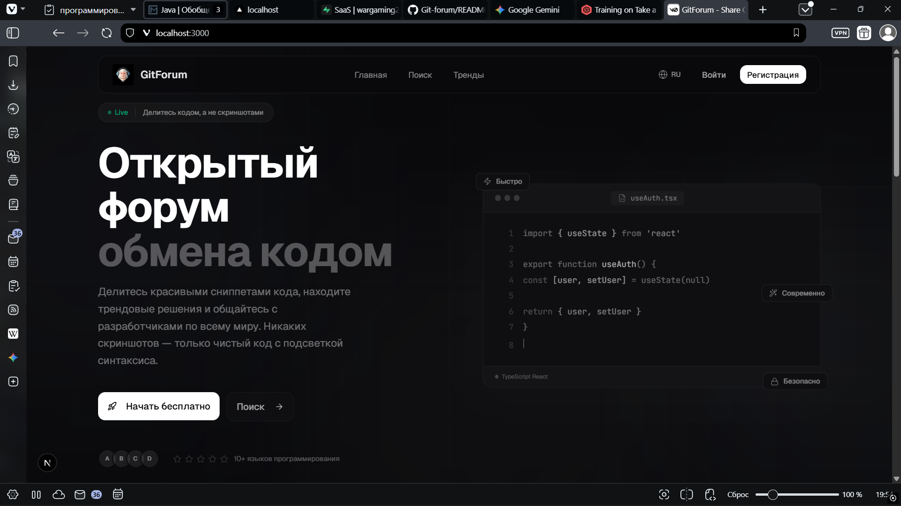
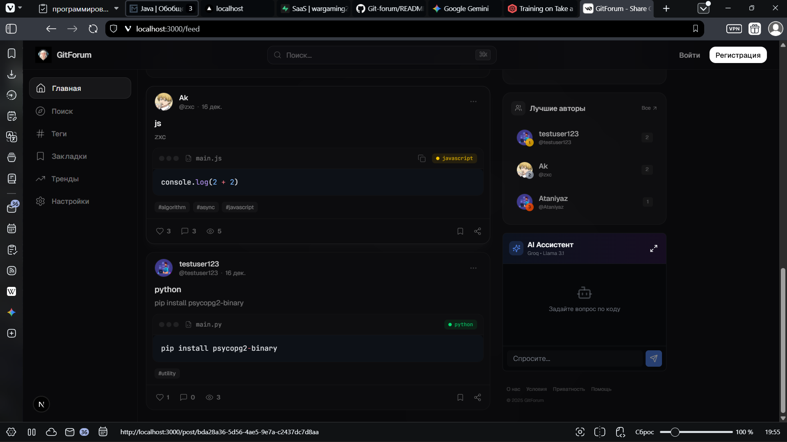
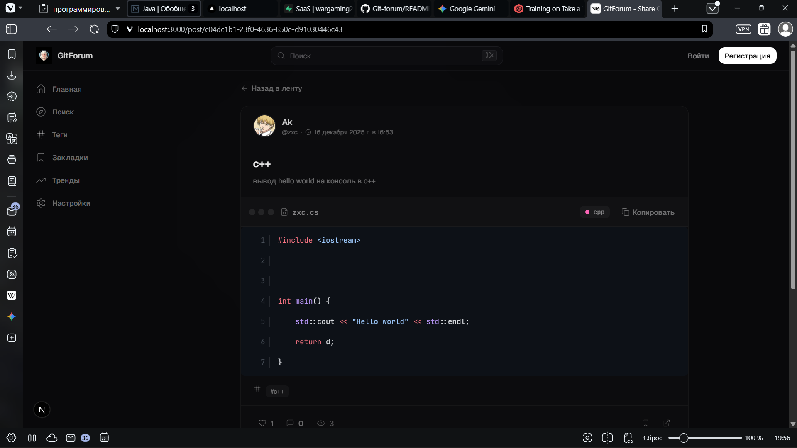
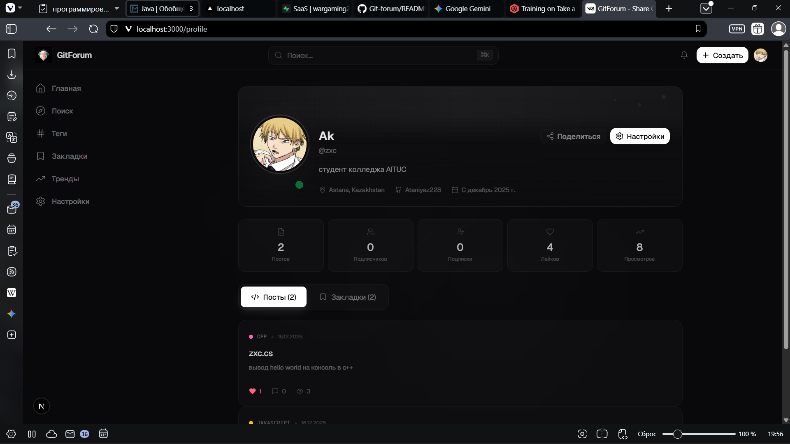

<div align="center">


# GitForum

**A modern developer community platform for sharing code, discussions, and collaboration**

[](https://nextjs.org/)
[](https://djangoproject.com/)
[](https://react.dev/)
[](https://typescriptlang.org/)
[](https://postgresql.org/)
[](https://tailwindcss.com/)

<br />

[Features](#features) · [Tech Stack](#tech-stack) · [Installation](#installation) · [Русский](#русский)

<br />

</div>

<!-- ═══════════════════════════════════════════════════════ -->

## Preview

<table>
<tr>
<td width="50%">


<p align="center"><sub><b>Landing Page</b></sub></p>

</td>
<td width="50%">


<p align="center"><sub><b>Content Feed</b></sub></p>

</td>
</tr>
<tr>
<td width="50%">


<p align="center"><sub><b>Post Detail</b></sub></p>

</td>
<td width="50%">


<p align="center"><sub><b>User Profile</b></sub></p>

</td>
</tr>
</table>

<!-- ═══════════════════════════════════════════════════════ -->

## Features

<table>
<tr>
<td>

### Authentication & Users

</td>
<td>

### Content & Community

</td>
</tr>
<tr>
<td valign="top">

- JWT-based secure authentication
- OAuth sign-in — Google, GitHub, GitLab, Discord
- Customizable user profiles with avatars
- Email-based password recovery

</td>
<td valign="top">

- Code posts with syntax highlighting
- Threaded comment system
- Likes, bookmarks, and sharing
- Tag-based content organization

</td>
</tr>
<tr>
<td>

### Discovery & Navigation

</td>
<td>

### AI & Localization

</td>
</tr>
<tr>
<td valign="top">

- Personalized content feed
- Trending posts and explore page
- Filter by language, tags, and popularity
- Responsive mobile-first design

</td>
<td valign="top">

- Built-in AI assistant (Groq / Llama 3.1)
- Full Russian and Kazakh interface
- Dark and light themes
- Customizable code display settings

</td>
</tr>
</table>

<!-- ═══════════════════════════════════════════════════════ -->

## Tech Stack

### Frontend

<table>
<tr>
<td align="center" width="100">
<br />
<sub><b>Next.js 16</b></sub>
</td>
<td align="center" width="100">
<br />
<sub><b>React 19</b></sub>
</td>
<td align="center" width="100">
<br />
<sub><b>TypeScript</b></sub>
</td>
<td align="center" width="100">
<br />
<sub><b>Tailwind 4</b></sub>
</td>
<td align="center" width="100">
<br />
<sub><b>Radix UI</b></sub>
</td>
</tr>
</table>

| Dependency | Role |
|:---|:---|
| `shiki` | Code syntax highlighting with theme support |
| `lucide-react` | Icon library |
| `recharts` | Data visualization |
| `react-hook-form` + `zod` | Form handling and validation |
| `next-themes` | Theme management (dark/light) |
| `sonner` | Toast notifications |

### Backend

<table>
<tr>
<td align="center" width="100">
<br />
<sub><b>Django 5</b></sub>
</td>
<td align="center" width="100">
<br />
<sub><b>DRF</b></sub>
</td>
<td align="center" width="100">
<br />
<sub><b>PostgreSQL</b></sub>
</td>
<td align="center" width="100">
<br />
<sub><b>Python 3.10+</b></sub>
</td>
</tr>
</table>

| Dependency | Role |
|:---|:---|
| `djangorestframework-simplejwt` | JWT token authentication |
| `django-allauth` | Social OAuth (Google, GitHub, GitLab, Discord) |
| `django-cors-headers` | CORS configuration |
| `django-filter` | API query filtering |
| `Pillow` | Image processing and uploads |

<!-- ═══════════════════════════════════════════════════════ -->

## Installation

### Prerequisites

| Tool | Version |
|:---|:---|
| Node.js | >= 18.x |
| Python | >= 3.10 |
| PostgreSQL | >= 14 |

### 1 — Clone

```bash
git clone https://github.com/Ataniyaz228/Git-forum.git
cd Git-forum
```

### 2 — Frontend

```bash
npm install
cp .env.example .env.local
```

> Open `.env.local` and set your Groq API key ([console.groq.com](https://console.groq.com))

### 3 — Backend

```bash
cd backend
python -m venv venv

# Windows
venv\Scripts\activate
# macOS / Linux
source venv/bin/activate

pip install -r requirements.txt
cp env.template .env
```

> Open `backend/.env` and configure the database, OAuth credentials, and email settings

<details>
<summary><b>Environment variables reference</b></summary>

```env
# Django
DEBUG=True
SECRET_KEY=your-secret-key

# Database
DATABASE_NAME=gitforum
DATABASE_USER=postgres
DATABASE_PASSWORD=your_password
DATABASE_HOST=localhost
DATABASE_PORT=5432

# Frontend
FRONTEND_URL=http://localhost:3000

# OAuth (optional)
GOOGLE_CLIENT_ID=...
GOOGLE_CLIENT_SECRET=...
GITHUB_CLIENT_ID=...
GITHUB_CLIENT_SECRET=...

# Email (for password recovery)
EMAIL_HOST=smtp.gmail.com
EMAIL_PORT=587
EMAIL_HOST_USER=your_email@gmail.com
EMAIL_HOST_PASSWORD=your_app_password
```

</details>

### 4 — Database

```bash
psql -U postgres -c "CREATE DATABASE gitforum;"
cd backend
python manage.py migrate
python manage.py createsuperuser  # optional
```

### 5 — Run

```bash
# Terminal 1 — backend
cd backend
python manage.py runserver

# Terminal 2 — frontend
npm run dev
```

Open **http://localhost:3000**

<!-- ═══════════════════════════════════════════════════════ -->

## Project Structure

```
Git-forum/
├── app/                         # Next.js pages (App Router)
│   ├── auth/                    # OAuth callback
│   ├── bookmarks/               # Saved posts
│   ├── explore/                 # Discover content
│   ├── feed/                    # Personalized feed
│   ├── login/ & register/       # Authentication
│   ├── post/                    # Post detail
│   ├── profile/                 # User profile
│   ├── settings/                # User settings
│   ├── tags/ & trending/        # Browse & discover
│   └── page.tsx                 # Landing page
│
├── components/                  # React components
│   ├── ui/                      # Radix UI primitives
│   ├── navbar.tsx               # Navigation
│   ├── ai-assistant-widget.tsx  # AI chat
│   ├── comments.tsx             # Comment system
│   └── ...
│
├── contexts/                    # React context providers
│   ├── AuthContext.tsx           # Auth state
│   ├── LanguageContext.tsx       # i18n (RU / KZ)
│   └── CodeSettingsContext.tsx   # Code display prefs
│
├── backend/                     # Django API
│   ├── posts/                   # Posts app
│   ├── users/                   # Users & auth app
│   └── gitforum/                # Project config
│
└── public/                      # Static assets
```

---

<br />

<div align="center">

# Русский

</div>

<br />

## Возможности

<table>
<tr>
<td>

### Аутентификация

</td>
<td>

### Контент

</td>
</tr>
<tr>
<td valign="top">

- Безопасная JWT-аутентификация
- OAuth — Google, GitHub, GitLab, Discord
- Настраиваемые профили с аватарами
- Восстановление пароля через email

</td>
<td valign="top">

- Посты с подсветкой синтаксиса кода
- Древовидные комментарии
- Лайки, закладки и репосты
- Организация контента по тегам

</td>
</tr>
<tr>
<td>

### Навигация

</td>
<td>

### AI и локализация

</td>
</tr>
<tr>
<td valign="top">

- Персональная лента контента
- Тренды и страница исследования
- Фильтрация по языкам и тегам
- Адаптивный мобильный дизайн

</td>
<td valign="top">

- Встроенный AI-ассистент (Groq / Llama 3.1)
- Полный интерфейс на русском и казахском
- Тёмная и светлая темы
- Настройки отображения кода

</td>
</tr>
</table>

## Технологический стек

### Фронтенд

| Технология | Назначение |
|:---|:---|
| **Next.js 16** | React-фреймворк с App Router |
| **React 19** | UI-библиотека |
| **TypeScript 5** | Типобезопасная разработка |
| **Tailwind CSS 4** | Утилитарные стили |
| **Radix UI** | Доступные UI-компоненты |
| **Shiki** | Подсветка синтаксиса |
| **Recharts** | Визуализация данных |

### Бэкенд

| Технология | Назначение |
|:---|:---|
| **Django 5.0** | Веб-фреймворк |
| **Django REST Framework** | RESTful API |
| **SimpleJWT** | JWT-аутентификация |
| **django-allauth** | Социальная авторизация |
| **PostgreSQL** | База данных |
| **Pillow** | Обработка изображений |

## Установка

### Требования

| Инструмент | Версия |
|:---|:---|
| Node.js | >= 18.x |
| Python | >= 3.10 |
| PostgreSQL | >= 14 |

### 1 — Клонирование

```bash
git clone https://github.com/Ataniyaz228/Git-forum.git
cd Git-forum
```

### 2 — Фронтенд

```bash
npm install
cp .env.example .env.local
```

> Откройте `.env.local` и укажите ваш Groq API ключ

### 3 — Бэкенд

```bash
cd backend
python -m venv venv
venv\Scripts\activate          # Windows
pip install -r requirements.txt
cp env.template .env
```

> Откройте `backend/.env` и настройте подключение к БД, OAuth и email

### 4 — База данных

```bash
psql -U postgres -c "CREATE DATABASE gitforum;"
cd backend
python manage.py migrate
python manage.py createsuperuser  # опционально
```

### 5 — Запуск

```bash
# Терминал 1
cd backend && python manage.py runserver

# Терминал 2
npm run dev
```

Откройте **http://localhost:3000**

---

<div align="center">

<br />

**MIT License** · Made by [Ataniyaz](https://github.com/Ataniyaz228)

<br />

</div>